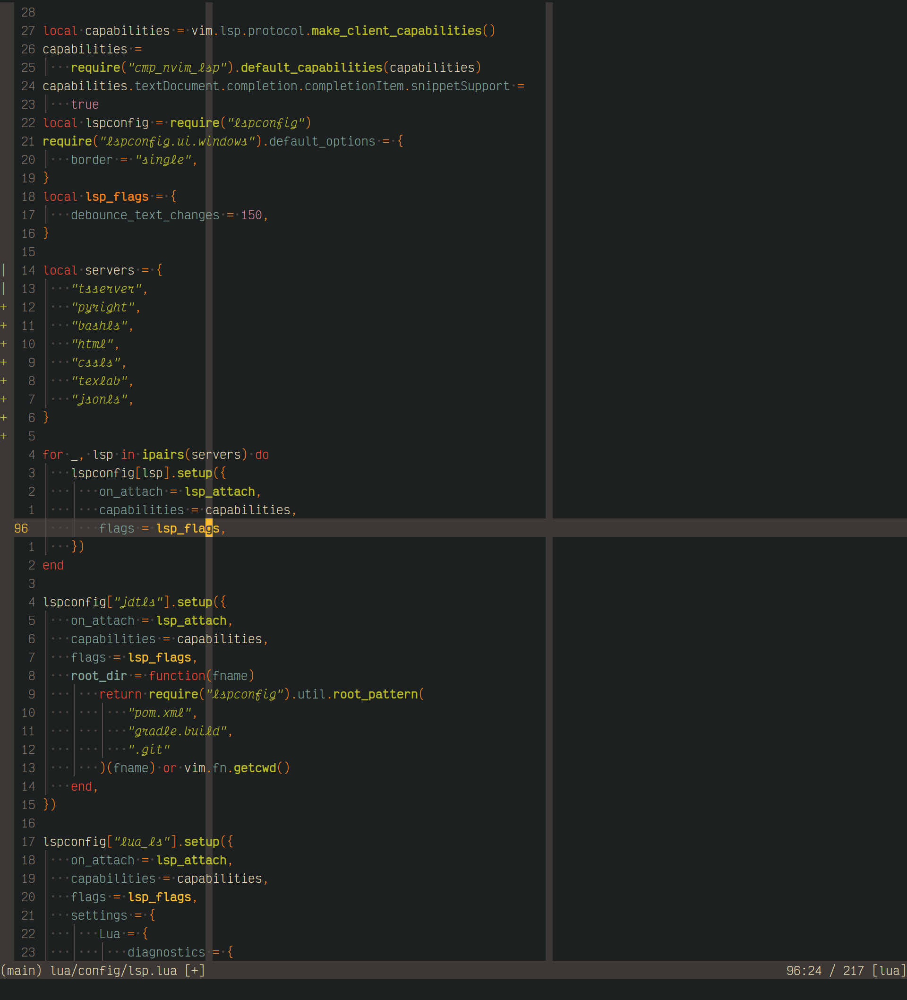

# Neovim Configuration

Neovim is a lightweight, highly extensible **TUI** modal text editor.
The latest versions include a lua API and LSP client, written in lua,
facilitating the use of an external language server to provide
completion, diagnostics and other code actions like an IDE. This
combination of features makes it a good editor for programming in many
different languages and environments.



I have tried to minimise the number of installed plugins, keeping only
the most essential and widely used. In some cases I have copied snippets
of Lua directly from other configurations/plugins into mine, this is
indicated wherever it occurs. This strategy will not entirely prevent
breaking changes and this configuration will need updating
semi-regularly. See `lua/plugins.lua`{.verbatim} for a list of installed
plugins.

In place of a colour scheme plugin, I am using a set of _base16_ schemes
from
[my theme repository](https://github.com/alexanderneville/b16-themes).
The only theme included in this repository by default is my custom theme
in the style of vs\*\*\*\*\'s default. To install a larger set of
themes:

```{.bash org-language="sh"}
cd utils
./install_themes.sh
cp colors/* ../colors
```
